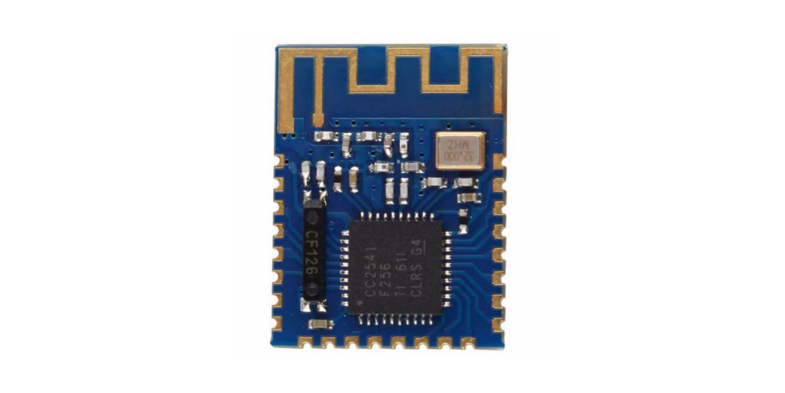
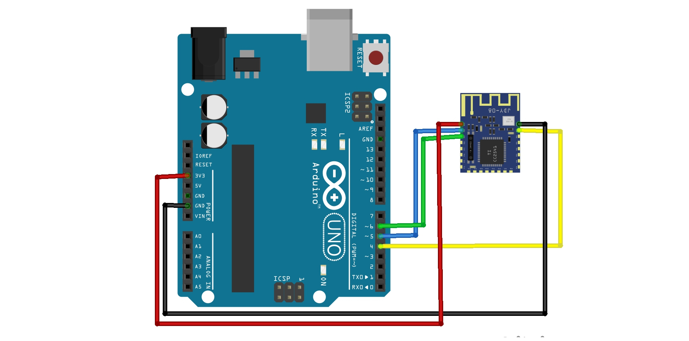
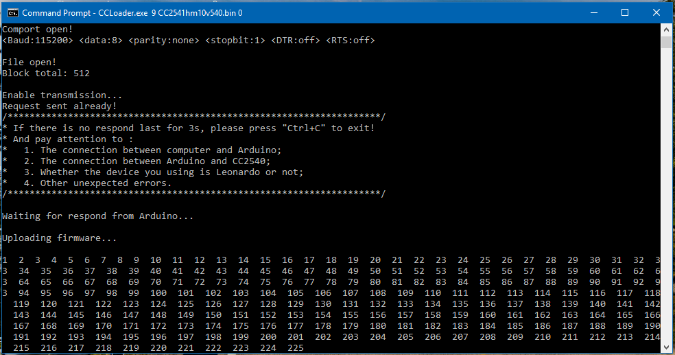
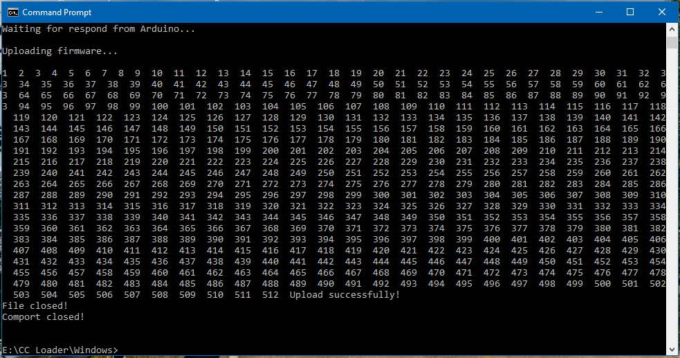
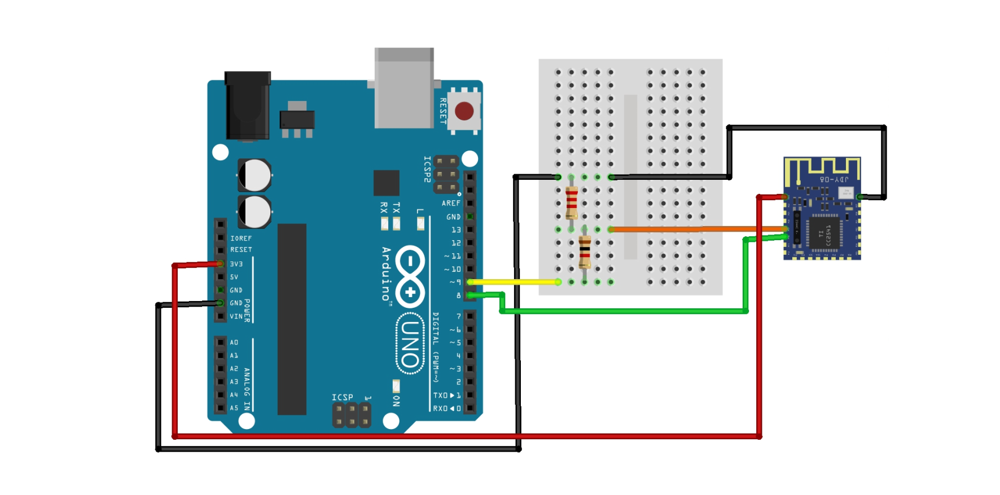
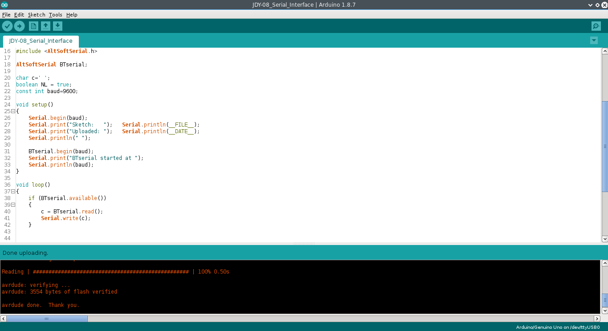
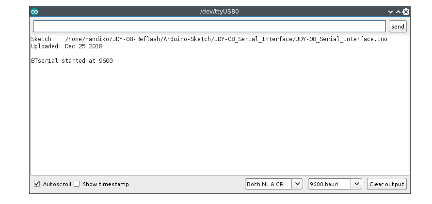

# JDY-08-Reflash
Replacing JDY-08 Bluetooth LE's firmware with the HM-10 v540. Firmware programming is done using Arduino UNO as the programmer/downloader.

## Requirements
* **JDY-08 BT Module** (TI CC2541)
* **Arduino UNO**
* **Arduino Sketch for programming the CC2541** (**CCLoader.ino** In the Arduino-Sketch Folder, or from [RedBear's GitHub](https://github.com/RedBearLab/CCLoader))
* **CCLoader.exe** Windows program as the programming software (Windows only). 
* **CC2541 V540 firmware binary file** This binary file is the firmware we are going to use to replace the existing firmware.
* **Arduino Sketch for using the Arduino UNO board as a Serial Interface** (**JDY-08_Serial_Interface.ino** In the Arduino-Sketch Folder).
* **AltSoftSerial Library for Arduino** in order to get the JDY-08_Serial_Interface.ino to work. This library is used to emulate second UART port on the Arduino UNO. This library can be downloaded from [AltSoftSerial GitHub](https://github.com/PaulStoffregen/AltSoftSerial) **Don't forget to install this library properly**, otherwise the sketch above will not compile.
* **1 1k Ohms resistor and 1 2k Ohms resistor** This resistor is wil be used as a voltage divider for int-face-ing 5V TTL level down to 3.3V.
* **Breadboard and some jumper wires**

## Reflash the chip (On a Windows Computer)
* Program the Arduino UNO with the **CCLoader.ino** sketch.
* Connect the JDY-08 module into the Arduino. **BE CAUTIOUS, JDY-08 is a 3.3V device, Connect the VCC JDY-08 pin1 to the 3.3V pin on the Arduino**. I manage to be able to program the CC2541 at 5V level, but it is NOT RECOMMENDED. 

* **Check the COM Port number** used by the Arduino. **Let say it is COM9. Note down the 9.**
* Open CMD, **navigate to the JDY-08-Reflash/CCLoader/Exe** folder. There are the CCLoader.exe and the CC2541hm10v540.bin.
The CCLoader.exe and the .bin file **must be in the same folder.**
* Still on the CMD, type **CCLoader.exe 9 CC2541hm10v540.bin 0** Number 9 is the COM port number and 0 means that we are using Arduino UNO board.

* If there's no error, the programming should start and continue for about 1 minute or more.

* Wait until it finishes.

* Now your JDY-08 has become HM-10 (but still in the JDY-08's physical form, of course).

## Physical Pins After Programming
After the programming, some of the physical pins are changed. The most important pins are:
* P13 become Wake-up Pin.
* P16 become UART TX.
* P17 become UART RX.

Some people said that it is necessary to pull down P13 to enter the AT mode. But for my experience, it's not. Try pull down the P13 if you encounter difficulty to enter AT mode.

## Testing the JDY-08 with HM-10 Firmware
To test the BLE module whether is was successfuly programed with the HM-10 firmware, we can run some simple AT commands to check if the module still alive and check the firmware version.

* **Wire your module to the Arduino UNO as the picture below.** Be carefull, don't forget to power the JDY-08 from 3.3V power source, wire some jumper to connect the P16 (JDY-08 UART TX) to the Arduino UNO D8, and the P17 (JDY-08 UART RX) to the Arduino UNO D9 thru resistors voltage divider.

* **Upload JDY-08_Serial_Interface.ino** into your Arduino UNO (don't forget to install AltSoftSerial library first).

* **Open Serial Monitor window, set to 9600baud, NL & CR,** then message below should appear. If not, try press the Arduino Reset button.

* **Check Whether the JDY-08 responding AT Commands**. This test will confirm whether the JDY-08 responding the incoming AT Commands. The commands that we are going to send is AT+VERR? which will ask the module what version of the firmware is installed. To do this, first you need to type **AT** then [SEND] and the module should relply with OK. This indicate the module is recognizing AT command and still responding. Second you need to type **AT+VERR?** then [SEND]. The module should reply with "HMSoft V540"

If this test is success, then your JDY-08 module with HM-10 V540 firmware is ready to go!

## Acknowledgement
Thank you for:
* [https://www.iot-experiments.com/jdy-08/](https://www.iot-experiments.com/jdy-08/)
* [https://elementztechblog.wordpress.com/2017/03/23/ibeacon-using-hm10-ble-module/](https://elementztechblog.wordpress.com/2017/03/23/ibeacon-using-hm10-ble-module/)
* [https://github.com/RedBearLab/CCLoader](https://github.com/RedBearLab/CCLoader)
* [https://github.com/PaulStoffregen/AltSoftSerial](https://github.com/PaulStoffregen/AltSoftSerial)

## Contributing
1. Fork it [https://github.com/handiko/JDY-08-Reflash/fork](https://github.com/handiko/JDY-08-Reflash/fork)
2. Create new branch (`git checkout -b add-blah-blah`)
3. Do some editing / create new feature
4. Commit your works (`git commit -m "Adding some blah blah blah.."`)
5. Push to the branch (`git push -u origin add-blah-blah`)
6. Create a new Pull Request